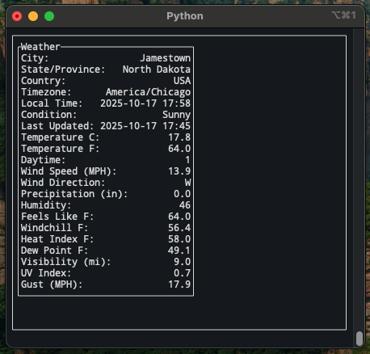

# Weather Watcher TUI
A terminal user interface (TUI) for keeping an eye on the weather.

Weather Watcher TUI periodically queries WeatherAPI.com for updates and displays selected weather fields in an ASCII-styled dashboard. You can configure the refresh interval, displayed fields, and location all from your terminal.

## Features
- Live weather updates at a configurable interval
- Lightweight curses-based TUI
- Customizable data fields (toggle keys in `processing.py` -> `Config.keys`
- UTF-8 box-drawing UI
- Built with uv for easy installation and environment management

## Dependencies

| Dependency                | Purpose                               |
| ------------------------- | ------------------------------------- |
| UV                        | Environment and dependency manager    |
| Python 3.13+              | Core Language                         |
| dotenv                    | Loads your API Key from .env          |
| requests                  | Handles HTTP requests to WeatherAPI   |
| UTF-8-compatible terminal | Required for line art characters      |

*Developed and tested on MacOS; should work on most Linux terminals. Windows compatibility not yet verified.*

## Requirements
Create a `.env` file in `~/.weatherwatcher/` with your WeatherAPI key:
```
API_KEY=YOUR_API_KEY_HERE
```

## Usage
Run the program using the following command:
```
uv run path/to/main.py
```
When prompted to enter a location, enter the zip code or city name and press `enter`. If no data is found for the location, it will continue to ask for input.

Once the Weather window is displayed, you can press the `q` key to exit the program, or `r` to reopen the location selection window.

## Planned Features
- [x] Ability to change locations
- [ ] Toggleable Fahrenheit/Celsius option
- [x] Ability to store previous locations and select them from a dropdown menu
- [ ] Ability to add new APIs to request from and display data dynamically
- [ ] Graphics to represent the weather conditions

## Examples

### Basic weather view


## Developer Notes
- Update the refresh interval or displayed keys in `processing.py` -> `Config`
- To Packaged and run globally using uv:
```bash
uv tool install .
weatherwatcher
```
